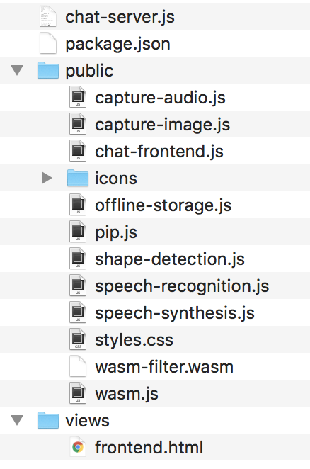
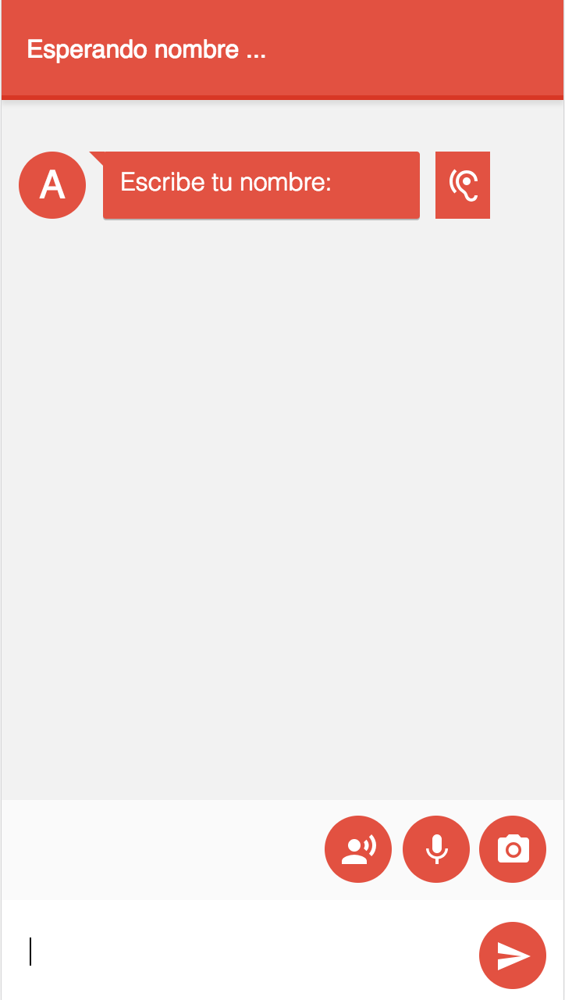
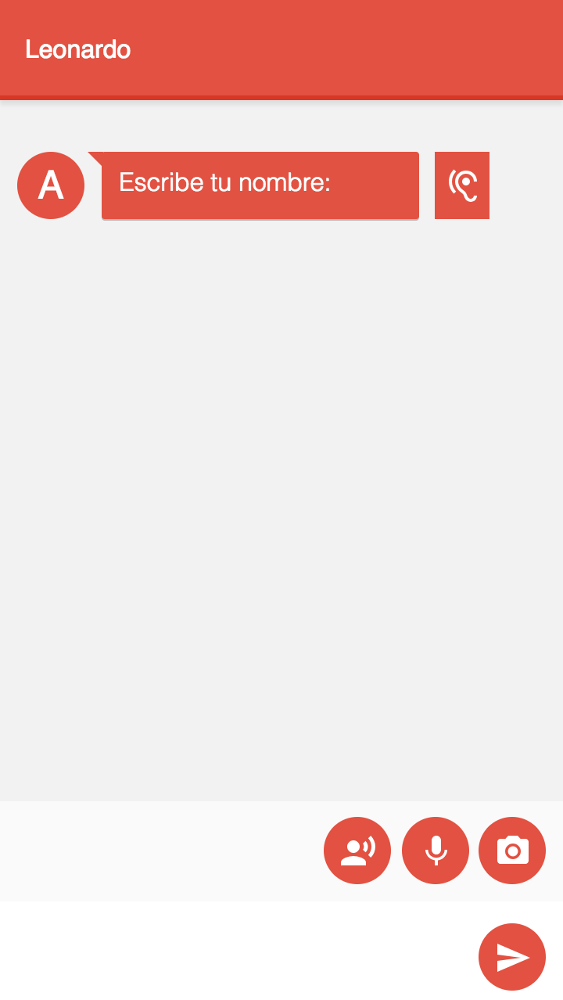
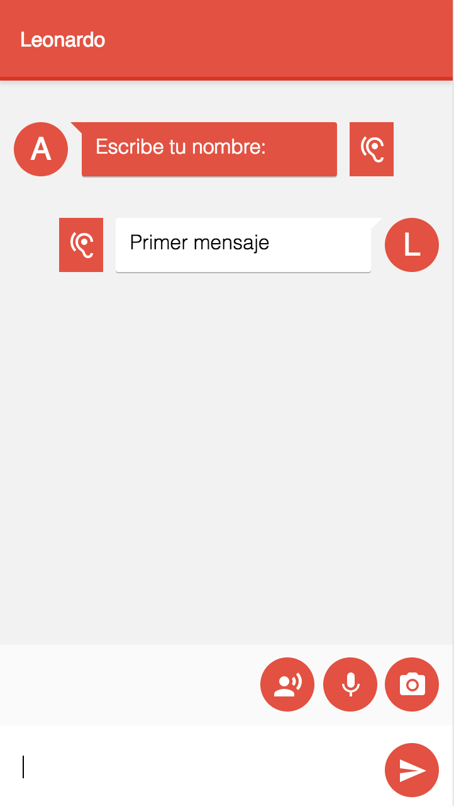
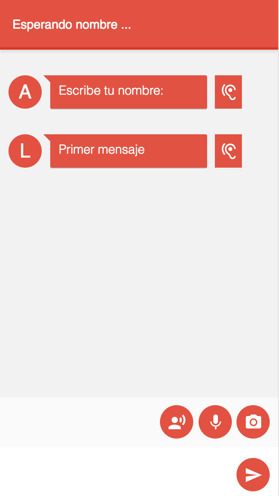
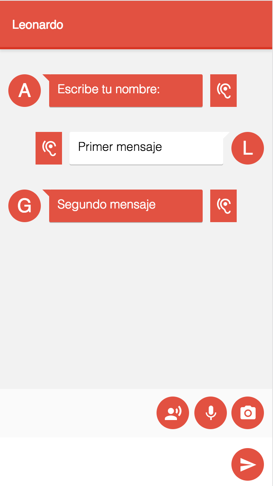

# 2. Entendiendo el proyecto 🔎

Durante todo el workshop vamos a trabajar sobre un sitio web que es un chat de texto, agregando funcionalidad y aprovechando todo el poder de la web para hacerlo más interesante. En este módulo, vamos a recorrer la solución inicial para entender de qué se trata, como también que tecnologías utiliza.

## Estructura del proyecto

Lo primero que vamos a ver es la estructura del proyecto. El mismo se trata de un proyecto web con un servidor hecho en [node.js](https://nodejs.org/en/) con [express](https://expressjs.com) y un cliente que usa JavaScript puro (sin frameworks).

Ahora, vamos a comenzar a revisar el proyecto mirando el código.

1. Primero, copiar la carpeta **code** ubicada en la raíz del repositorio a algún lugar cómodo para poder trabajar (ejemplo: el escritorio o la carpeta de usuario). Todo lo que hagamos será sobre ese mismo código.

1. Abrir la carpeta con _VS Code_ o la herramienta que prefiera para ver la estructura de archivos.

    

    _Estructura de la carpeta del proyecto_

1. Para recorrer el proyecto, vamos a arrancar abriendo el archivo _package.json_. Éste archivo es típico de un proyecto hecho en _node.js_ y contiene las dependencias e información del mismo.

1. Notar que en el nodo `scripts`, está configurado el llamado _start_ ejecutando el archivo _chat-server.js_.

    ```json
    "scripts": {
        "test": "echo \"Error: no test specified\" && exit 1",
        "start": "node chat-server.js"
    },
    ```

### Servidor

1. Ahora, abrir el archivo _chat-server.js_. Éste contiene todo el código del servidor.

1. Notar que para la comunicación con el servidor vamos a usar websockets _(más sobre esto en el próximo módulo)_. Al inicio del archivo importamos el server de **websockets**, **express** que usaremos para servir los archivos estáticos y **multer**, el middleware que usaremos para la subida de archivos.

    ```js
    const path = require("path");
    const webSocketServer = require('websocket').server;
    const express = require('express');
    const multer  = require('multer');
    const imageUploads = multer({ dest: 'uploads/images/' });
    const audioUploads = multer({ dest: 'uploads/audios/' });
    const app = express();
    ```

1. Más abajo, definimos las rutas para servir los archivos de la carpeta **public** (con todos los estáticos de la app), la carpeta **uploads** (donde se guardarán los audios y videos subidos por los usuarios), la ruta de la **raíz** que devuelve el html completo, y las rutas que responden a las subidas de **audios** y **videos**.

    ```js
    app.use('/public', express.static(path.join(__dirname, 'public')));
    app.use('/uploads', express.static(path.join(__dirname, 'uploads')));
    app.get('/', function (req, res) {
       res.sendFile(__dirname + '/views/frontend.html');
    });
    
    app.post('/images', imageUploads.single('image'), function (req, res, next) {   
       // ...
    });
    app.post('/audios', audioUploads.single('audio'), function (req, res, next) {
       // ...
    });
    ```

1. Más abajo vamos a crear el servidor de websockets en sí mismo.

    ```js
    const wsServer = new webSocketServer({
        httpServer: server
    });
    ```
    
    > *Nota:* El servidor de WebSocket se crea relacionado a un servidor HTTP común. En este caso, nuestro servidor express que creamos anteriormente.

1. Finalmente, nos falta repasar el manejo de los sockets. Esta es la función que se ejecuta cada vez que alguien se conecta al servidor de WebSockets.
    ```js
    wsServer.on('request', function(request) {
       // ...
    });
    ```

1. Dentro de esa función, tenemos otros dos eventos importantes: ```message``` y ```close```.

1. Cuando llega un mensaje, si es el primero de ese usuario, lo tomamos como su nombre. Sino, guardamos ese mensaje en la historia que manejamos en memoria y se lo reenviamos a todos los clientes conectados.
    ```js
        connection.on('message', function(message) {
            // ...
        });
    ```

1. Cuando se cierra una conexión, borramos al cliente.
    ```js
    connection.on('close', function(connection) {
        // ...
    });
    ```

### Cliente
1. Tenemos una única vista de html que el servidor nos devolverá renderizado.

1. Y una serie de archivos estáticos en la carpeta _public_:
    
    - **icons**: Una serie de íconos svg que usaremos en nuestra UI. Tomados de [Material design](https://material.io/tools/icons).
    - **js**: Varios archivos JavaScript. Por el momento vacíos. Los iremos completando a medida que vayamos avanzando en el workshop. Idealmente, es un archivo por cada módulo. 
    - **styles**: Todos los estilos necesarios para nuestra aplicación.

1. El archivo más interesante por el momento es: **chat-frontend.js** que maneja toda la lógica de conexión con el servidor. Recorramos su contenido deteniéndonos en los puntos más interesantes:

    1. Definimos el closure que encierra nuestro código (explicado en el módulo de conceptos).
    ```js
       const chat = (function () {
    ```
    
    1. Definimos algunas variables globales al módulo e inicializamos las referencias a los elementos del DOM que necesitaremos.
        ```js
           let connection;
           let connectionError = false;
           let myName = false;
           const content = document.getElementById('content');
           const inner = document.getElementById('inner');
           const input = document.getElementById('input');
           const sendButton = document.getElementById('send');
        ``` 
    
    1. Definimos algunas funciones útiles como: 
        - `scrollBottom` que nos servirá para scrollear al fondo cada vez que recibamos un mensaje,
        - `buildMessageHTML` que armará el HTML correspondiente a cada tipo de mensaje que recibamos.
        - `send` que nos servirá para enviar mensajes al servidor.
        - `notify` que nos servirá para mostrar mensajes como si hubieran sido recibidos desde el servidor.
    
    1. Pero la función más interesante es `init`.
        - Haciendo uso de Progressive Enhancement, si el browser no soporta websockets, mostramos un mensaje.
        ```js
        if (!window.WebSocket) {
            notify("Este navegador no soporta web sockets");
            return;
        }
        ```
        - Iniciamos la conexión con el servidor.
        ```js
       connection = new WebSocket('ws://127.0.0.1:1337');
        ```
        - Nos suscribimos a los distintos eventos del socket.
            - `onopen`: Pedimos al usuario que ingrese su nombre.
            - `onerror`: Mostramos un mensaje de error.
            - `onmessage`: Cuando llega un nuevo mensaje, lo mostramos.
         - Bindeamos los eventos del campo de texto para enviar mensajes
         - Y finalmente, chequeamos el estado de la conexión cada cierto tiempo para mostrar un mensaje de error cuando se corta la misma.

1. Por último, antes de pasar a la siguiente tarea, recorrer los archivos para ver qué hay en cada uno a la hora de comenzar.

## Probando la solución

Ahora que ya vimos los archivos que contiene nuestra solución, las tecnologías utilizadas y exploramos un poco de la misma, vamos a proceder a verla en funcionamiento.

1. Primero, abrir una consola/terminal en la carpeta donde se haya copiado la solución.

1. Antes de iniciar el servidor, debemos asegurarnos de tener las dependencias instaladas, para esto, ejecutamos el siguiente comando.

    ```
    npm install
    ```

    

    _Resultado de ejecutar el comando_
    

1. Una vez que termine de instalar las dependencias, iniciaremos el servidor con el siguiente comando.

    ```
    npm start
    ```

    

    _Resultado de ejecutar el comando_

1. Ahora, abrir el browser y navegar a [http://localhost:1337](http://localhost:3000).

    

    _Sitio funcionando_

1. Escribir tu nombre y presionar el botón de enviar. Debería cambiar el título de la ventana y mostrar el nombre donde antes decía _"Escribir nombre..."_

    

    _Resultado de enviar el nombre_
    
1. Escribir otro mensaje y presionar el botón de enviar. Debería aparecer en la pantalla.

    

    _Resultado de enviar un mensaje_

1. Abrir otra pestaña o ventana y entrar a la url de la aplicación [http://localhost:1337](http://localhost:3000). Deberíamos ver el mensaje enviado desde la otra ventana pero, en este caso, a la izquierda.

    

    _Resultado de abrir otra pesaña_

1. En la nueva pestaña, elegir un nombre y probar enviando otro mensaje. Debería aparecer en la pestaña original.

    

    _Resultado de volver a la nueva pestaña con mensajes nuevos_
    
1. Como se puede notar, hay varios botones extra. Por el momento ninguno de esos tiene un comportamiento. A modo de simplificación, es más sencillo que estén visibles desde el principio y que vayamos agregándole su funcionalidad paso a paso.

## Conclusiones

En este módulo exploramos la aplicación que vamos a usar en el transcurso de todo el workshop. Es una aplicación web bastante simple pero que nos permite explotar muchas características modernas de la web. Hay que notar que hay varias cosas, como por ejemplo el almacenamiento de mensajes en el servidor, que son simplificaciones de una aplicación real para no distraer del real objetivo del workshop.

## Próximo modulo
Avanzar al [módulo 3 - Conceptos principales 📜](../03-conceptos)
