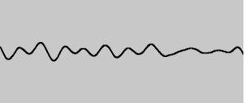

# Capturar audio 🎙️

¿Qué tipo de chat seríamos si no permitiéramos enviar un audio?

En este módulo vamos a empezar a agregar funcionalidades haciendo uso de todo lo que nos proveen los navegadores.

En este caso, enviar archivos de audio. El funcionamiento será el siguiente:

1. Hacer click en el botón de capturar audio para empezar a grabar.
1. Aceptar los permisos de micrófono.
1. Aparecerá el audio como un nuevo mensaje.

Por detrás, lo que haremos será:
1. Enviar el audio a nuestro servidor.
1. Al guardar el archivo con éxito, mandaremos un mensaje de tipo audio con la url del mismo a todos los usuarios conectados.
1. Al recibir el mensaje de tipo audio, mostraremos un reproductor para poder escucharlo.


_Demo UI_

## Conceptos

En el módulo anterior repasamos conceptos que utilizaremos en este módulo como websockets, closures, canvas.

Nos quedan algunos más de los que todavía no hablamos y vamos a necesitar.

### getUserMedia

El método `MediaDevices.getUserMedia()` solicita al usuario permisos para usar un dispositivo de entrada de video y/o uno de audio como una cámara o compartir la pantalla y/o micrófono.

Si el usuario proporciona los permisos, entonces le retornará una `Promise` que es resuelta con el resultado del objeto `MediaStream`.

Si el usuario niega el permiso, o si el recurso multimedia no es válido, entonces la promesa es rechazada con `PermissionDeniedError` o `NotFoundError` respectivamente.

> Nota: Es posible que la promisa retornada no sea ni resuelta ni rechazada, ya que no se requiere que el usuario tome una decisión.

### Media Recorder
La interfaz `MediaRecorder` de la API `MediaStream Recording` provee funcionalidad para grabar media fácilmente. Se crea invocando al constructor MediaRecorder().

`MediaRecorder.start()` comienza a grabar. Acepta, opcionalmente, un valor en milisegundos para grabar en porciones de esa duración. Si no se especifica, grabará una única porción del total de la duración del audio.

### Blob
Un objeto `Blob` representa un objeto tipo archivo de datos planos inmutables. Los `Blobs` representan datos que no necesariamente se encuentran en un formato nativo de JavaScript.

Una forma fácil de construir un `Blob` es invocando el constructor `Blob()`. Otra manera es utilizando el método `slice()` para crear un `blob` que contiene un subconjunto de los datos de otro `Blob`.

### FormData
Los objetos `FormData` proporcionan una forma para construir fácilmente un conjunto de pares llave/valor que representan campos de un formulario y sus valores, los cuales pueden enviarse fácilmente a través de un request `AJAX`.

## Implementación

Iremos paso a paso completando el archivo **capture-audio.js** de la carpeta **public**.

### Inicialización y código base

Abrir entonces el archivo **capture-audio.js** y dentro de la función agregar el siguiente código.

```js
const button = document.getElementById('send-audio');
const canvas = document.getElementById('audio-visualizer');

let audioCtx;
const canvasCtx = canvas.getContext("2d");
let isRecording = false;
let chunks = [];
let animationId, mediaRecorder;
```

A destacar:
- `button` es el botón que tendremos que presionar para grabar un audio:

    
    
    _Botón_
    
- `canvas` es el canvas donde mostraremos la representación gráfica del audio que estamos enviando.

    
            
    _Visualizer_

### Uso de `getUserMedia`
Si tenemos acceso a la API de `getUserMedia`, en el `click` del botón, pedimos el acceso al audio (si no estábamos grabando) o cortamos la grabación y el visualizador (si ya estábamos grabando).

Por otro lado, si tenemos éxito al solicitar el acceso al audio, iniciamos la grabación y la visualización y decimos que al finalizar, se ejecute la función `sendFile`.

Finalmente, si no tenemos acceso a la API, mostramos una notificación. 

En el mismo archivo y también dentro de la función, agregar el siguiente código después del anterior:
```js
if (navigator.mediaDevices.getUserMedia) {

    const onSuccess = function(stream) {
        mediaRecorder = new MediaRecorder(stream);

        mediaRecorder.onstop = sendFile;
        mediaRecorder.ondataavailable = e => { chunks.push(e.data); };

        mediaRecorder.start();

        visualize(mediaRecorder.stream);

        canvas.classList.add("show");
        button.classList.add("animated");
    };

    const onError = function(err) {
        isRecording = false;
        chat.notify("Ocurrió un error");
    };

    button.onclick = function() {
        if (!audioCtx) {
            audioCtx = new (window.AudioContext || webkitAudioContext)();
        }

        if (isRecording) {
            mediaRecorder.stop();
            mediaRecorder.stream.getTracks().forEach( track => track.stop() );
            cancelAnimationFrame(animationId);
            canvas.classList.remove("show");
            button.classList.remove("animated");
        } else {
            navigator.mediaDevices.getUserMedia({ audio: true }).then(onSuccess, onError);
        }

        isRecording = !isRecording;
    };
} else {
    chat.notify("Este navegador no soporta getUserMedia");
}
```

### Enviando el audio
En el paso anterior dijimos que al finalizar la grabación se ejecute la función `sendFile`, esa función es la que se detalla a continuación y que tenemos que sumar por debajo del código anterior.

Lo que hacemos es:
1. Armar un `Blob` con todos los chunks que nos dió la API.
1. Armar un `FormData` que contenga ese archivo.
1. Hacemos el request a nuestro servidor para guardar ese archivo usando `fetch`.
1. Si el servidor nos responde satisfactoriamente, mandamos un mensaje de tipo audio con la url del mismo.

```js
function sendFile() {
    const blob = new Blob(chunks, { 'type' : 'audio/ogg; codecs=opus' });
    const form = new FormData();
    form.append('audio', blob, 'newAudio.png');
    
    fetch('/audios', {
        method: 'POST',
        body: form
    })
        .then((response) =>  {
            if (response.status >= 200 && response.status <= 302) {
                return response
            } else {
                const error = new Error(response.statusText);
                error.response = response;
                throw error
            }
        })
        .then(response => response.json())
        .then((data) => {
            chat.send({ type: "audio", url: data.url});
        })
        .catch((error) => {
            chat.notify('Error enviando el audio');
        });
    
    chunks = [];
}
```
    
### Visualizer
Por último nos queda construir el visualizer. El código necesario para eso está a continuación. Agregarlo por debajo de la función `sendFile`:

A partir del `stream` de audio, creamos un `Analyzer` y dibujamos, frame a frame un `path`en el `canvas`

```js
function visualize(stream) {
    const source = audioCtx.createMediaStreamSource(stream);

    const analyser = audioCtx.createAnalyser();
    analyser.fftSize = 2048;
    const bufferLength = analyser.frequencyBinCount;
    const dataArray = new Uint8Array(bufferLength);

    source.connect(analyser);

    draw();

    function draw() {
        const width = canvas.width;
        const height = canvas.height;

        animationId = requestAnimationFrame(draw);

        analyser.getByteTimeDomainData(dataArray);

        canvasCtx.fillStyle = 'rgb(200, 200, 200)';
        canvasCtx.fillRect(0, 0, width, height);

        canvasCtx.lineWidth = 2;
        canvasCtx.strokeStyle = 'rgb(0, 0, 0)';

        canvasCtx.beginPath();

        const sliceWidth = width * 1.0 / bufferLength;
        let x = 0;

        for(let i = 0; i < bufferLength; i++) {
            const v = dataArray[i] / 128.0;
            const y = v * height/2;

            if(i === 0) {
                canvasCtx.moveTo(x, y);
            } else {
                canvasCtx.lineTo(x, y);
            }

            x += sliceWidth;
        }

        canvasCtx.lineTo(canvas.width, canvas.height/2);
        canvasCtx.stroke();
    }
}
```

## Listo!
Ahora toca probar lo que hicimos. Enviemos un audio y probemos reproducirlo!

 